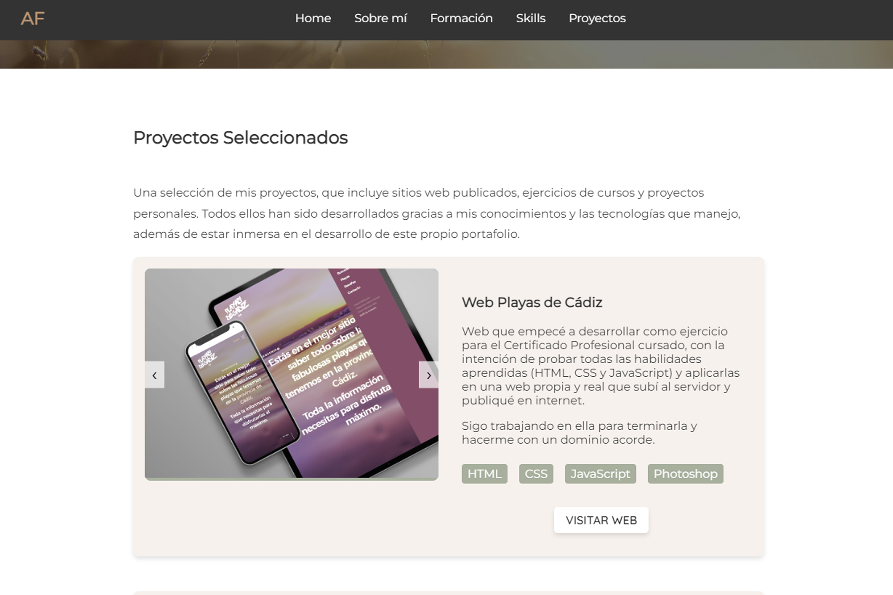

# Mi Portafolio

Mi portfolio personal, una one-page creada desde cero en la que se puede navegar por mi perfil profesional como Desarrolladora Web Frontend.
Inlcuye apartados como Sobre mí, Formación, Habilidades duras y mis proyectos preferidos.
Desarrollado por mí 100% desde cero, con HTML, CSS y JavaScript.
#portfolio #frontenddeveloper #webdevelopment #html #css #javascript

## Captura de Pantalla

## Ver ejemplo en vivo
[https://isaan86.github.io/mi_Portafolio/](https://isaan86.github.io/mi_Portafolio/)
[https://alexandra-ferrera-portfolio.netlify.app/](https://alexandra-ferrera-portfolio.netlify.app/)

## Tecnologías Utilizadas

- HTML5
- CSS3
- JavaScript
- Git
- Photoshop

## Contacto

Para cualquier pregunta o comentario, no dudes en contactarme:

- Nombre: Alexandra Ferrera Arenas
- Perfil de Linkedin: https://www.linkedin.com/in/alexandra-ferrera-arenas/
- Correo Electrónico: sandraferreraarenas@gmail.com